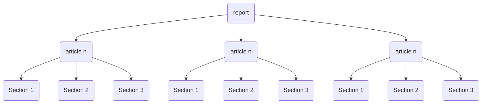

# React experimental UI

Experimental UI based in this [tableau UI](https://www.tableau.com/es-es/reports/data-trends) 

## How to run

1. Install package dependencies

```bash
# Use one of this commands
yarn install
npm install
```

2. Install package dependencies

```bash
# Use one of this commands
yarn start
npm start
```


## Data structure

The root node is the report, each report contains n articles and each article has n sections.



### Report

```json
{
  "id": "1",
  "title": "Enim reprehenderit consequat Lorem culpa magna id voluptate magna voluptate fugiat cupidatat id aute et.",
  "abstract": "Exercitation officia velit duis labore. Sunt nostrud voluptate non sint tempor ea officia ut. Do dolor dolor culpa do proident commodo tempor ullamco fugiat minim elit nisi id. Tempor eiusmod ipsum excepteur et Lorem."
}
```

### Article

```json
{
  "id": "1",
  "title": "In amet ex culpa incididunt ex aliqua."
}
```

### Section

```json
{
  "content": "Ut non consectetur exercitation est ullamco sunt pariatur duis consequat ipsum amet id. Commodo labore ea reprehenderit et sint. Ut reprehenderit minim irure id officia ut deserunt qui. Ut eiusmod in aliquip cupidatat amet consequat duis qui eiusmod mollit nulla labore esse non. Aliqua proident sint voluptate sunt exercitation fugiat mollit aliqua nisi occaecat id consectetur quis."
}
```